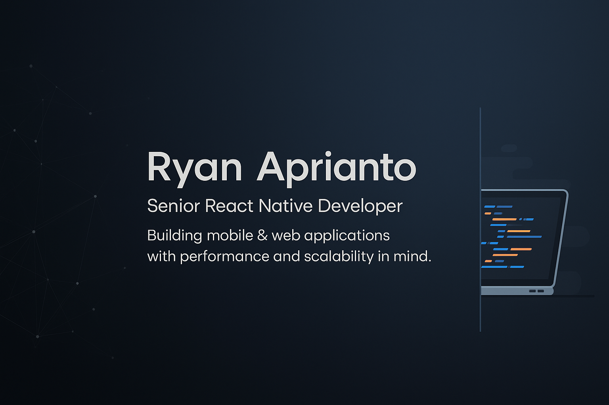

<!-- Banner -->

# Hey there, I’m Ryan Aprianto 👋

💻 **Senior React Native Developer | Fullstack Developer | Freelancer**  
I craft **high-performance mobile & web applications** with clean architecture and attention to detail.  
From concept to deployment, I turn ideas into impactful, scalable digital products. 🚀  

---

## ⚡ About Me  
- 🛠 **6+ years** as a Freelance Developer, **4+ years** in React Native  
- 💡 Expert in **Mobile Apps, Web Apps, and Backend Systems**  
- 🔥 Strong focus on **Performance Optimization & Clean Code**  
- 🏢 Experience with **startups, enterprises, and government projects**  
- 🧑‍🏫 Love mentoring and sharing knowledge with teams  
- 🌍 Open for **remote work & global collaborations**  

---

## 🛠 Tech Stack  
I speak multiple languages — both human 👨‍💬 and machine 🖥.  

---

## 📊 My GitHub Stats  

---

## 🌐 Let’s Connect  

---

⭐ _"Clean code, smooth UX, and optimal performance — not just goals, but my standard."_  
