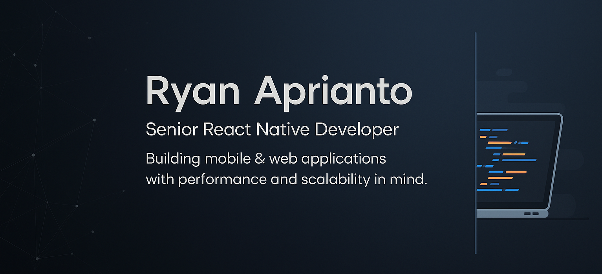

<!-- Banner -->

  

<h1 align="center">Hey there, I’m Ryan Aprianto 👋</h1>

💻 <strong>Senior React Native Developer | Fullstack Developer | Freelancer</strong>  
I craft <strong>high-performance mobile & web applications</strong> with clean architecture and attention to detail.  
From concept to deployment, I turn ideas into impactful, scalable digital products. 🚀

---

## ⚡ About Me  
- 🛠 **6+ years** as a Freelance Developer, **4+ years** in React Native  
- 💡 Expert in **Mobile Apps, Web Apps, and Backend Systems**  
- 🔥 Strong focus on **Performance Optimization & Clean Code**  
- 🏢 Experience with **startups, enterprises, and government projects**  
- 🧑‍🏫 Love mentoring and sharing knowledge with teams  
- 🌍 Open for **remote work & global collaborations**  

---

## 🛠 Tech Stack  

---

## 🏆 Trophy Showcase  

  

---

## 📊 GitHub Stats & Languages  

  
  

---

## 📈 Visitor Counter  

  

---

## ✨ Random Quote  

  

---

## 🌐 Let’s Connect  

---

⭐ _"Clean code, smooth UX, and optimal performance — not just goals, but my standard."_  
